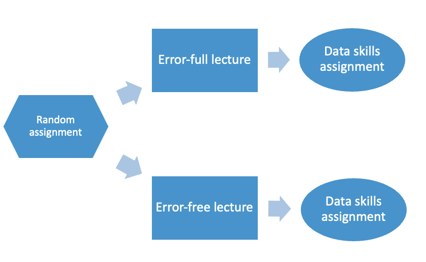

```{r setup, include = FALSE, message=FALSE, warning=FALSE}
# load packages for bare bones demo
library(papaja)
library(pwr)
library(dplyr)
library(ggplot2)
library(readr)

# papaja function to create .bib file of all loaded R packages
r_refs("r-references.bib", 
       append = FALSE) # Overwrite rather than append previous entries
```

```{r analysis-preferences}
# Seed for random number generation
set.seed(42)
knitr::opts_chunk$set(cache.extra = knitr::rand_seed)
```

Data skills are increasingly recognised as a key component of psychological literacy. To promote reproducible data preparation and analysis workflows, educators have highlighted the role of teaching students how to use statistical programming languages instead of point-and-click software [@mcaleer_embedding_2022]. However, programming is rare in UK psychology curricula [@targ_meta-research_group_statistics_2022] and offers unique challenges such as how to prepare students to debug their code. Debugging code is a separate problem solving skill to learn alongside statistics, so it is important to understand how best to teach students debugging skills. 

@hoffman_students_2021 reported a small pilot study using SAS where they compared a traditional error-free course structure to an error-full course focusing on debugging errors alongside key concepts. 80% of students preferred the error-full course but the study only included 18 participants and just 4 students completed assignments following each course, meaning they could not compare performance. Therefore, in our study, we want to apply these methods to the programming language R and recruit a larger sample. 

We hypothesise that students who complete the error-full lecture will score higher on a data skills assignment than students who complete the error-free lecture. 

# Methods

## Participants

```{r}
# Power analysis inputs
alpha <- 0.05
power <- .90

# Smallest effect size of interest based on small telescopes approach
small_telescopes <- pwr.t2n.test(n1 = 25, n2 = 50, power = 0.33, sig.level = 0.05)$d

# Calculate sample size using inputs and smallest effect size of interest
sample_size <- ceiling( # round up to integer
  pwr.t.test(d = small_telescopes,
                          sig.level = alpha, 
                          power = power,
                          type = "two.sample",
                          alternative = "two.sided")$n # Isolate sample size from results
  )
```

Before collecting data, we performed an *a priori* power analysis to calculate how many participants we would need. @hoffman_students_2021 did not report any performance data, so we used @bebermeier_creating_2019 to set our smallest effect size of interest. They investigated the effect of creating statistics exercises based on research article. The researchers found students performed better on a class assignment when they completed these exercises than when students did not complete the exercises (*d* = 0.55). The authors did not comment on the effect size, so we chose a more conservative estimate based on the small telescopes approach [@simonsohn_small_2015] for the effect size the original study had 33% power to detect. Using an effect size of d = `r small_telescopes`, we aimed to recruit `r sample_size` participants per group for an independent samples t-test ($\alpha$ = `r alpha`, power = `r power`). 

We finished with two groups of 145 and 130 participants (N = 275), slightly fewer than our initial target. 

## Material

In the error-free lecture, students heard a one hour presentation on data wrangling, showing how to use Tidyverse functions like mutate, filter, and select. 

In the error-full lecture, students heard a one hour presentation on data wrangling, the same as in the error-free group. However, in this group we also guided students through an error interpretation session to demonstrate common errors when using these data wrangling functions. 

Both groups of students completed the same data skills assignment on data wrangling where students had to write code to solve problems and debug errors. Scores could range from 0-100%. 

## Procedure

We offered participants an additional bonus lecture outside their normal course curriculum. Students could register interest on their course page and provide informed consent. On sign up, students were randomly allocated to attend the error-free lecture or error-full lecture. In the hour immediately following the lecture, students completed the data skills assignment and were debriefed. We provided students who did not receive the error-full lecture a link to the lecture recording to ensure they received the debugging guidance. We demonstrate the procedure as a diagram in Figure \@ref(fig:procedure-diagram).

(ref:procedure-diagram-caption) Procedure diagram showing how students were randomly allocated to an error-free or error-full version of a lecture before completing a data skills assignment. 

```{r procedure-diagram, fig.cap="(ref:procedure-diagram-caption)", out.width="100%"}
# Knitr function to include an image from a given directory
# Size can be an issue, so can control in the R chunk using out.width


```

## Design and data analysis

We had one between-subjects IV with two levels. Participants were randomly allocated to attend the error-free (level 1) or error-full (level 2) version of the lecture. We had one dependent variable of their score on the data skills assignment which could range between 0-100%. 

Data met parametric assumptions and we used a Welch t-test to compare the two groups on their data skills score. We used a two-tailed test as we expected the error-full lecture to produce higher scores, but we were open to the possibility that the error-free lecture could produce higher scores. 

# Results

```{r simulate data}
# Function I had prepared from a student project where we had to simulate the same design over and over

# How many participants per group?
n1 <- 145 # Error free
n2 <- 130 #Error full

# Features of group A - Error free
A_mean <- 50
A_sd <- 10

# Features of group B - Error full - 0.5 SDs better
B_mean <- 55
B_sd <- 10

# Take inputs and simulate data from normal distribution
# Bind rows to turn into a tidy dataset
group_sim <- function(n, A_mean, A_sd, B_mean, B_sd){
  group_A <- data.frame(Group = "Error-Free",
                        DV = rnorm(n = n1,
                                   mean = A_mean,
                                   sd = A_sd))
  
  group_B <- data.frame(Group = "Error-Full",
                        DV = rnorm(n = n2,
                                   mean = B_mean,
                                   sd = B_sd))
  
  # Combine into one data set
  sim_data <- bind_rows(group_A, group_B)
  
  return(sim_data)
  
}

set.seed(12847) # Based on a random process, so set a seed for reproducibility

# Run the function once to simulate based on arguments defined above

mock_data <- group_sim(n, A_mean, A_sd, B_mean, B_sd)

# Mutate to turn group into a factor
mock_data <- mock_data %>% 
  mutate(Group = factor(Group))
```

```{r descriptives-table}
# Take mock data and group by group variable
# Calculate bunch of descriptive statistics
mock_descriptives <- mock_data %>% 
  group_by(Group) %>% 
  summarise(Mean = mean(DV),
            SD = sd(DV),
            Min = min(DV),
            Max = max(DV)) %>% 
  ungroup() # Always ungroups 

# papaja function to round and save as character
descriptives <- printnum(mock_descriptives)

# papaja function to creata APA table
apa_table(descriptives,
          caption = "Descriptive statistics of data skills assignment for each lecture group.",
          note = "Test scores could range from 0-100%")
```

```{r ttest}
# Save ttest as object
mock_ttest <- t.test(DV ~ Group, 
                     data = mock_data, 
                     paired = FALSE)

# papaja helper function of printing results in APA
apa_ttest <- apa_print(mock_ttest)$full_result

```

We present the descriptive statistics in Table \@ref(tab:descriptives-table) and visually in Figure \@ref(fig:violin-plot). Consistent with our hypothesis, participants in the error-full group scored higher than participants in the error-free group.

(ref:violin-plot-caption) Violin and boxplot of the data skills assignment score for the error-free and error-full groups. The central dot shows the mean and SE instead of the median.  

```{r violin-plot, fig.cap="(ref:violin-plot-caption)", out.width="100%", warning = FALSE}

# Create modified violin box plot as we're working with continuous outcome
mock_data %>% 
  ggplot(aes(x = Group, y = DV, fill = Group)) + # Group as IV, data skills as DV
  geom_violin() +
  geom_boxplot(width = .2, # Control boxplot width   
               fatten = NULL, # remove the median line with fatten = NULL 
               colour = "black") + # Colour of boxplot
  stat_summary(fun = "mean", geom = "point") + # Add mean instead of median
  stat_summary(fun.data = "mean_se", # Add SE around the mean
               geom = "errorbar", 
               width = .1) + # Control error bar width
  scale_fill_viridis_d(option = "D", # Viridis for colour blind friendly pallete
                       begin = 0.3, end = 0.6) + # Control colour region
  theme_classic() + 
  theme(legend.position = "None") + 
  labs(x = "Lecture Group",
       y = "Data skills test score (%)")

```

Consistent with our hypothesis, a Welch t-test shows that participants in the error-full group produced significantly higher data skills assignment scores than those in the error-free group, `r apa_ttest`. 

# Discussion

We hypothesised that students who experienced an error-full lecture would score higher on a data skills assignment than students who experienced an error-free lecture. Consistent with our prediction, participants in the error-full group scored significantly higher than participants in the error-free group with an almost 5% increase. 

We designed our study to build on @hoffman_students_2021 who compared error-full and error-free SAS lectures. However, they only recruited 18 participants in a pilot study and did not report performance data. We applied their idea to the software R and randomly allocated participants into one of two groups to evaluate the effect of this format on a data skills assignment focusing on data wrangling. 

In conclusion, a lecture format that covers both data wrangling and debugging skills has the potential to improve student's understanding of reproducible data preparation and analysis. 

# Disclosures

We used `r cite_r("r-references.bib")` for all our analyses.

\newpage

# References

::: {#refs custom-style="Bibliography"}
:::
